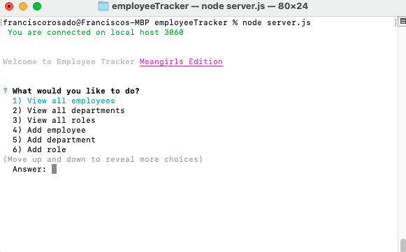

# EmployeeTracker

## Your Task

Developers are often tasked with creating interfaces that make it easy for non-developers to view and interact with information stored in databases. Often these interfaces are known as **C**ontent **M**anagement **S**ystems. In this homework assignment, my challenge wasto architect and build a solution for managing a company's employees using node, inquirer, and MySQL.

## Acceptance Criteria-Usage

Build a command-line application that at a minimum allows the user to:

  * Add departments, roles, employees

  * View departments, roles, employees

  * Update employee roles

## Screenshots

## Links

link to github: https://github.com/Franciscorosado09/employeeTracker

Link to video: https://drive.google.com/file/d/1cLcomfjCdj221YQreu3k5kI8AXUHXHhc/view?usp=sharing

## FAQ/resources

    * Startercode GW Bootcamp
    * W3 schools, Stackoverflow, BCS, and WebMd 
    *Feedback, brainstorming, and general support to study group
        1. Young Ji Kim - https://github.com/youjmi
        2. Amir Ashtiany - https://github.com/Alexfit4
        3. Johnnie Simpson - https://github.com/balokdecoy
        4. Rachel Wanke - https://github.com/rwanke14

 For clarification feel free to reach out to Francisco Rosado, Franciscorosado09@.gmail.com
 
